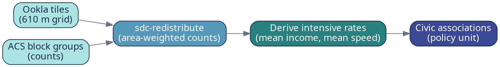
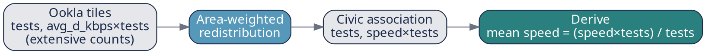

# Guide Visual System & Figure Generation — Implementation Plan (Plan 2)

> **For agentic workers:** REQUIRED SUB-SKILL: Use superpowers:subagent-driven-development (recommended) or superpowers:executing-plans to implement this plan task-by-task. Steps use checkbox (`- [ ]`) syntax for tracking.

**Goal:** Build the reproducible visual system — a shared design/style module, reusable map helpers, the full inventory of code-generated figures, and the flowchart diagrams — that the Quarto guide (Plan 3) will embed, all driven from the real `data/civic_combined.geojson` produced by Plan 1.

**Architecture:** A `pipeline/style.py` design-system module encodes the approved identity (fonts, palette, colorblind-safe colormaps, the 3×3 bivariate scheme, figure constants) once. `pipeline/maps.py` provides reusable, single-responsibility plotting helpers (reproject, choropleth, bivariate map, locator, scatter) that all consume the style module. `pipeline/figures.py` orchestrates one function per guide figure, writing PNGs to `figures/`. Flowcharts are authored as Graphviz DOT (styled to the palette) and rendered to PNG+SVG. Pure logic (CRS reprojection, bivariate color mapping, class breaks) is TDD'd; figure functions get smoke tests asserting a non-trivial image file is produced, plus human visual review between tasks.

**Tech Stack:** Python 3.12, `geopandas`, `matplotlib`, `mapclassify`, `contextily` (basemaps, optional), `graphviz` (DOT rendering), `pytest`. Builds on Plan 1's env and data.

---

## Real-data facts this plan is built on (verified from `data/`)

- `data/civic_combined.geojson` — EPSG:4326, **62** rows, columns: `geoid, region_name, agg_income, households, mean_income, tests, download_mbps, upload_mbps, income_speed_ratio, bivariate_class, geometry`. No NaNs. Ranges: `mean_income` 73,078–468,010; `download_mbps` 100.8–343.8; `upload_mbps` 49.3–207.2; `income_speed_ratio` 238.0–2489.5. `bivariate_class` values are `"{income_tercile}-{speed_tercile}"`, all 9 present.
- `data/ookla_tiles_arlington.geojson` — EPSG:4326, 617 tiles, `avg_d_kbps, avg_u_kbps, tests, …`.
- `data/va013_acs_income_counts.geojson` — EPSG:4269, 204 block groups, `GEOID, agg_income, households`.
- `data/va013_block_groups.geojson` — EPSG:4269, 204 block groups (`GEOID`, names).

## File structure

```
local_level_data/
  fonts/                       # OFL TTFs (Libre Franklin, Source Serif 4, JetBrains Mono)
  pipeline/
    style.py                   # design system: palette, cmaps, bivariate scheme, rcParams, legend
    maps.py                    # reproject + choropleth/bivariate/locator/scatter helpers
    figures.py                 # one function per guide figure → figures/*.png ; main() builds all
  figures/                     # generated raster figures (committed guide assets)
    diagrams/                  # *.dot source + rendered *.png/*.svg flowcharts
  tests/
    test_style.py              # palette + bivariate color mapping (TDD)
    test_maps.py               # reprojection + class-break logic (TDD)
    test_figures_smoke.py      # each figure produces a non-trivial PNG
```

## Design constants (the approved identity, made concrete)

- Fonts: **Libre Franklin** (figure titles/labels), **Source Serif 4** (reserved for the document), **JetBrains Mono** (code). Figures use Libre Franklin with a graceful sans fallback.
- Palette: `ink=#1B2A4A`, `blue=#2166AC`, `teal=#2A7F7F`, `amber=#D8732E`, `gray=#6B7280`, `light=#E5E7EB`.
- Sequential colormap: **viridis**. Diverging: **RdBu_r**.
- Bivariate 3×3 (Joshua Stevens "purple-blue", colorblind-reasonable), keyed `"income-speed"`:
  `1-1=#e8e8e8 1-2=#ace4e4 1-3=#5ac8c8 / 2-1=#dfb0d6 2-2=#a5add3 2-3=#5698b9 / 3-1=#be64ac 3-2=#8c62aa 3-3=#3b4994`.
- Plotting CRS: **EPSG:26918** (UTM 18N, metres) for choropleths so scale bars are accurate; **EPSG:3857** only when a contextily basemap is used.
- Figure output: 300 DPI PNG.

---

## Task 1: Acquire brand fonts

Best-effort fetch of the three OFL fonts into `fonts/`. The style module (Task 2) registers whatever TTFs are present and falls back cleanly if any are missing, so a failed download is non-fatal.

**Files:**
- Create: `fonts/` (directory with TTFs)
- Create: `pipeline/_fetch_fonts.py` (helper script)

- [ ] **Step 1: Write `pipeline/_fetch_fonts.py`**

```python
"""Best-effort download of the guide's OFL fonts into ./fonts.

Variable TTFs from the google/fonts repo. Failure is non-fatal — style.py falls
back to a generic sans-serif when a font is absent.
"""
from __future__ import annotations

import urllib.request
from pathlib import Path

FONTS = {
    "LibreFranklin.ttf": "https://github.com/google/fonts/raw/main/ofl/librefranklin/LibreFranklin%5Bwght%5D.ttf",
    "SourceSerif4.ttf": "https://github.com/google/fonts/raw/main/ofl/sourceserif4/SourceSerif4%5Bopsz,wght%5D.ttf",
    "JetBrainsMono.ttf": "https://github.com/google/fonts/raw/main/ofl/jetbrainsmono/JetBrainsMono%5Bwght%5D.ttf",
}


def main() -> None:
    out = Path(__file__).resolve().parent.parent / "fonts"
    out.mkdir(exist_ok=True)
    for name, url in FONTS.items():
        dest = out / name
        if dest.exists():
            print(f"have {name}")
            continue
        try:
            urllib.request.urlretrieve(url, dest)
            print(f"fetched {name} ({dest.stat().st_size} bytes)")
        except Exception as e:  # noqa: BLE001 - best effort
            print(f"WARN could not fetch {name}: {e}")


if __name__ == "__main__":
    main()
```

- [ ] **Step 2: Run it**

Run: `uv run python -m pipeline._fetch_fonts`
Expected: prints `fetched …` for each of the three fonts (or `WARN …` if a URL is unavailable — that is acceptable; continue).

- [ ] **Step 3: Verify and commit**

Run: `ls -la fonts/`
Expected: at least one `.ttf` present (ideally all three). Commit whatever was fetched:

```bash
git add pipeline/_fetch_fonts.py fonts/
git commit -m "feat: fetch guide brand fonts (OFL)"
```

If NO fonts downloaded at all (all WARN), still commit `pipeline/_fetch_fonts.py` and report DONE_WITH_CONCERNS noting figures will use the sans fallback.

---

## Task 2: Design-system / style module

**Files:**
- Create: `pipeline/style.py`
- Test: `tests/test_style.py`

- [ ] **Step 1: Write the failing test**

```python
# tests/test_style.py
from pipeline import style


def test_palette_has_core_colors():
    for key in ("ink", "blue", "teal", "amber", "gray", "light"):
        assert key in style.PALETTE
        assert style.PALETTE[key].startswith("#") and len(style.PALETTE[key]) == 7


def test_bivariate_has_nine_classes():
    keys = {f"{i}-{j}" for i in (1, 2, 3) for j in (1, 2, 3)}
    assert set(style.BIVARIATE_COLORS) == keys


def test_bivariate_color_lookup():
    # high income (3), low speed (1) → the strong magenta corner
    assert style.BIVARIATE_COLORS["3-1"] == "#be64ac"
    assert style.BIVARIATE_COLORS["1-1"] == "#e8e8e8"
    assert style.BIVARIATE_COLORS["3-3"] == "#3b4994"


def test_apply_style_is_idempotent_and_sets_dpi():
    style.apply_style()
    import matplotlib as mpl
    assert mpl.rcParams["savefig.dpi"] == style.FIG_DPI
    style.apply_style()  # second call must not raise
```

- [ ] **Step 2: Run test to verify it fails**

Run: `uv run pytest tests/test_style.py -v`
Expected: FAIL (ModuleNotFoundError).

- [ ] **Step 3: Write `pipeline/style.py`**

```python
"""Shared visual identity for all guide figures: palette, colormaps, fonts."""
from __future__ import annotations

from pathlib import Path

import matplotlib as mpl
import matplotlib.font_manager as fm
import matplotlib.pyplot as plt

PALETTE = {
    "ink": "#1B2A4A",
    "blue": "#2166AC",
    "teal": "#2A7F7F",
    "amber": "#D8732E",
    "gray": "#6B7280",
    "light": "#E5E7EB",
}

SEQUENTIAL = "viridis"
DIVERGING = "RdBu_r"

# 3×3 bivariate scheme (Joshua Stevens purple-blue), keyed "income-speed".
BIVARIATE_COLORS = {
    "1-1": "#e8e8e8", "1-2": "#ace4e4", "1-3": "#5ac8c8",
    "2-1": "#dfb0d6", "2-2": "#a5add3", "2-3": "#5698b9",
    "3-1": "#be64ac", "3-2": "#8c62aa", "3-3": "#3b4994",
}

FIG_DPI = 300
MAP_CRS = "EPSG:26918"   # UTM 18N (metres) — accurate scale bars for Arlington
WEB_MERCATOR = "EPSG:3857"

_FONTS_DIR = Path(__file__).resolve().parent.parent / "fonts"
_HEADING_FAMILY = "Libre Franklin"


def _register_fonts() -> str:
    """Register any TTFs in ./fonts. Return the heading family if available."""
    family = "sans-serif"
    if _FONTS_DIR.exists():
        for ttf in _FONTS_DIR.glob("*.ttf"):
            try:
                fm.fontManager.addfont(str(ttf))
            except Exception:  # noqa: BLE001
                continue
        names = {f.name for f in fm.fontManager.ttflist}
        if _HEADING_FAMILY in names:
            family = _HEADING_FAMILY
    return family


def apply_style() -> None:
    """Apply the guide's matplotlib rcParams. Safe to call repeatedly."""
    family = _register_fonts()
    plt.rcParams.update({
        "savefig.dpi": FIG_DPI,
        "figure.dpi": 150,
        "savefig.bbox": "tight",
        "font.family": family,
        "axes.titlesize": 14,
        "axes.titleweight": "bold",
        "axes.titlecolor": PALETTE["ink"],
        "axes.labelcolor": PALETTE["ink"],
        "text.color": PALETTE["ink"],
        "axes.edgecolor": PALETTE["gray"],
        "figure.facecolor": "white",
    })


def bivariate_legend(ax) -> None:
    """Draw a 3×3 bivariate key on the given (small inset) axes."""
    for i in (1, 2, 3):          # income tercile → vertical
        for j in (1, 2, 3):      # speed tercile → horizontal
            ax.add_patch(
                mpl.patches.Rectangle(
                    (j - 1, i - 1), 1, 1, color=BIVARIATE_COLORS[f"{i}-{j}"]
                )
            )
    ax.set_xlim(0, 3)
    ax.set_ylim(0, 3)
    ax.set_aspect("equal")
    ax.set_xticks([])
    ax.set_yticks([])
    ax.set_xlabel("Speed →", fontsize=8)
    ax.set_ylabel("Income →", fontsize=8)


def add_north_arrow(ax) -> None:
    """Add a simple north arrow in the upper-left of a map axes."""
    ax.annotate(
        "N",
        xy=(0.06, 0.96), xytext=(0.06, 0.86),
        xycoords="axes fraction",
        arrowprops=dict(arrowstyle="-|>", color=PALETTE["ink"], lw=1.5),
        ha="center", va="center", fontsize=11, fontweight="bold",
        color=PALETTE["ink"],
    )


def add_scale_bar(ax, length_m: float = 2000.0, label: str = "2 km") -> None:
    """Draw a scale bar of ``length_m`` metres (axes must be in a metric CRS)."""
    x0, x1 = ax.get_xlim()
    y0, y1 = ax.get_ylim()
    x = x0 + (x1 - x0) * 0.06
    y = y0 + (y1 - y0) * 0.06
    ax.plot([x, x + length_m], [y, y], color=PALETTE["ink"], lw=3,
            solid_capstyle="butt")
    ax.text(x + length_m / 2, y + (y1 - y0) * 0.015, label,
            ha="center", va="bottom", fontsize=8, color=PALETTE["ink"])
```

- [ ] **Step 4: Run test to verify it passes**

Run: `uv run pytest tests/test_style.py -v`
Expected: PASS (4 passed).

- [ ] **Step 5: Commit**

```bash
git add pipeline/style.py tests/test_style.py
git commit -m "feat: add figure design-system (palette, bivariate scheme, rcParams)"
```

---

## Task 3: Map helpers

**Files:**
- Create: `pipeline/maps.py`
- Test: `tests/test_maps.py`

- [ ] **Step 1: Write the failing test**

```python
# tests/test_maps.py
import geopandas as gpd
from shapely.geometry import box
from pipeline import maps


def _gdf():
    return gpd.GeoDataFrame(
        {"v": [1.0, 2.0]},
        geometry=[box(-77.1, 38.8, -77.0, 38.9), box(-77.0, 38.8, -76.9, 38.9)],
        crs="EPSG:4326",
    )


def test_to_plot_crs_reprojects_to_metric():
    out = maps.to_plot_crs(_gdf())
    assert out.crs.to_epsg() == 26918


def test_choropleth_returns_figure_with_axes():
    import matplotlib
    matplotlib.use("Agg")
    fig = maps.choropleth(_gdf(), "v", title="t", legend_label="v")
    assert fig is not None
    assert len(fig.axes) >= 1
```

- [ ] **Step 2: Run test to verify it fails**

Run: `uv run pytest tests/test_maps.py -v`
Expected: FAIL (ModuleNotFoundError).

- [ ] **Step 3: Write `pipeline/maps.py`**

```python
"""Reusable map plotting helpers built on the guide style system."""
from __future__ import annotations

import geopandas as gpd
import matplotlib.pyplot as plt

from pipeline import style

style.apply_style()


def to_plot_crs(gdf: gpd.GeoDataFrame) -> gpd.GeoDataFrame:
    """Reproject to the metric plotting CRS (UTM 18N)."""
    return gdf.to_crs(style.MAP_CRS)


def choropleth(
    gdf: gpd.GeoDataFrame,
    column: str,
    *,
    title: str,
    legend_label: str,
    cmap: str = style.SEQUENTIAL,
    scheme: str = "Quantiles",
    k: int = 5,
    fmt: str = "{:.0f}",
    ax=None,
):
    """Return a Figure with a classed choropleth of ``column``."""
    g = to_plot_crs(gdf)
    if ax is None:
        fig, ax = plt.subplots(figsize=(7, 8))
    else:
        fig = ax.figure
    g.plot(
        column=column, cmap=cmap, scheme=scheme, k=k, legend=True,
        edgecolor="white", linewidth=0.4, ax=ax,
        legend_kwds={"title": legend_label, "loc": "lower right", "fmt": fmt},
        missing_kwds={"color": style.PALETTE["light"], "label": "No data"},
    )
    ax.set_title(title)
    ax.set_axis_off()
    style.add_north_arrow(ax)
    style.add_scale_bar(ax)
    return fig


def bivariate_map(
    gdf: gpd.GeoDataFrame,
    class_col: str = "bivariate_class",
    *,
    title: str,
    ax=None,
):
    """Return a Figure with a 3×3 bivariate choropleth and an inset key."""
    g = to_plot_crs(gdf)
    colors = g[class_col].map(style.BIVARIATE_COLORS).fillna(style.PALETTE["light"])
    if ax is None:
        fig, ax = plt.subplots(figsize=(7, 8))
    else:
        fig = ax.figure
    g.plot(color=colors, edgecolor="white", linewidth=0.4, ax=ax)
    ax.set_title(title)
    ax.set_axis_off()
    style.add_north_arrow(ax)
    style.add_scale_bar(ax)
    inset = fig.add_axes([0.16, 0.16, 0.16, 0.16])
    style.bivariate_legend(inset)
    return fig


def locator_map(
    gdf: gpd.GeoDataFrame,
    *,
    title: str,
    label_col: str | None = None,
    facecolor: str | None = None,
    ax=None,
):
    """Return a Figure outlining ``gdf`` (optionally labelled at centroids)."""
    g = to_plot_crs(gdf)
    if ax is None:
        fig, ax = plt.subplots(figsize=(7, 8))
    else:
        fig = ax.figure
    g.plot(
        ax=ax, edgecolor=style.PALETTE["ink"], linewidth=0.5,
        facecolor=facecolor or style.PALETTE["light"],
    )
    if label_col:
        for _, row in g.iterrows():
            c = row.geometry.representative_point()
            ax.annotate(row[label_col], (c.x, c.y), fontsize=5,
                        ha="center", color=style.PALETTE["ink"])
    ax.set_title(title)
    ax.set_axis_off()
    style.add_north_arrow(ax)
    style.add_scale_bar(ax)
    return fig


def scatter(
    df,
    x: str,
    y: str,
    *,
    title: str,
    xlabel: str,
    ylabel: str,
    ax=None,
):
    """Return a Figure scatter of ``y`` vs ``x`` with a correlation annotation."""
    if ax is None:
        fig, ax = plt.subplots(figsize=(7, 6))
    else:
        fig = ax.figure
    ax.scatter(df[x], df[y], color=style.PALETTE["blue"], s=28,
               edgecolor="white", linewidth=0.5, alpha=0.9)
    r = df[[x, y]].corr().iloc[0, 1]
    ax.set_title(title)
    ax.set_xlabel(xlabel)
    ax.set_ylabel(ylabel)
    ax.annotate(f"r = {r:.2f}", xy=(0.04, 0.93), xycoords="axes fraction",
                fontsize=11, color=style.PALETTE["ink"], fontweight="bold")
    return fig
```

- [ ] **Step 4: Run test to verify it passes**

Run: `uv run pytest tests/test_maps.py -v`
Expected: PASS (2 passed).

- [ ] **Step 5: Commit**

```bash
git add pipeline/maps.py tests/test_maps.py
git commit -m "feat: add reusable choropleth/bivariate/locator/scatter map helpers"
```

---

## Task 4: Generate the core raster figures

**Files:**
- Create: `pipeline/figures.py`
- Test: `tests/test_figures_smoke.py`

- [ ] **Step 1: Write `pipeline/figures.py`**

```python
"""Generate every raster figure used in the guide, into ./figures."""
from __future__ import annotations

from pathlib import Path

import geopandas as gpd
import matplotlib
import matplotlib.pyplot as plt

matplotlib.use("Agg")

from pipeline import config, maps, style

FIGURES = Path(__file__).resolve().parent.parent / "figures"


def _save(fig, name: str) -> Path:
    FIGURES.mkdir(exist_ok=True)
    out = FIGURES / name
    fig.savefig(out)
    plt.close(fig)
    return out


def _combined() -> gpd.GeoDataFrame:
    return gpd.read_file(config.CIVIC_COMBINED)


def fig_income() -> Path:
    fig = maps.choropleth(
        _combined(), "mean_income",
        title="Mean Household Income by Civic Association",
        legend_label="Mean income ($)", fmt="${:,.0f}",
    )
    return _save(fig, "map_income.png")


def fig_speed() -> Path:
    fig = maps.choropleth(
        _combined(), "download_mbps",
        title="Broadband Download Speed by Civic Association",
        legend_label="Download (Mbps)", fmt="{:.0f}",
    )
    return _save(fig, "map_speed.png")


def fig_ratio() -> Path:
    fig = maps.choropleth(
        _combined(), "income_speed_ratio",
        title="Income-to-Speed Ratio (\\$ per Mbps)",
        legend_label="$ per Mbps", cmap=style.DIVERGING, fmt="{:,.0f}",
    )
    return _save(fig, "map_ratio.png")


def fig_bivariate() -> Path:
    fig = maps.bivariate_map(
        _combined(),
        title="Digital Equity: Income × Broadband Speed",
    )
    return _save(fig, "map_bivariate.png")


def fig_scatter() -> Path:
    df = _combined()
    fig = maps.scatter(
        df, "mean_income", "download_mbps",
        title="Income vs. Broadband Speed",
        xlabel="Mean household income ($)", ylabel="Download speed (Mbps)",
    )
    return _save(fig, "scatter_income_speed.png")


def fig_locator() -> Path:
    civ = gpd.read_file(config.CIVIC_ASSOC)
    fig = maps.locator_map(
        civ, title="Arlington County Civic Associations",
        label_col="region_name",
    )
    return _save(fig, "fig_locator_civic.png")


def fig_ookla_tiles() -> Path:
    tiles = gpd.read_file(config.OOKLA_TILES)
    tiles["download_mbps"] = tiles["avg_d_kbps"] / 1000
    fig = maps.choropleth(
        tiles, "download_mbps",
        title="Ookla Speed-Test Tiles (Download Mbps)",
        legend_label="Download (Mbps)", k=5,
    )
    return _save(fig, "fig_ookla_tiles.png")


def fig_transformation_3panel() -> Path:
    """Hero figure: source broadband | source income | target civic associations."""
    tiles = gpd.read_file(config.OOKLA_TILES)
    tiles["download_mbps"] = tiles["avg_d_kbps"] / 1000
    acs = gpd.read_file(config.ACS_COUNTS)
    acs["mean_income"] = (
        acs["agg_income"] / acs["households"].where(acs["households"] > 0)
    )
    civ = _combined()

    fig, axes = plt.subplots(1, 3, figsize=(15, 6))
    maps.to_plot_crs(tiles).plot(
        column="download_mbps", cmap=style.SEQUENTIAL, ax=axes[0],
        edgecolor="none",
    )
    axes[0].set_title("Ookla tiles\n(610 m grid)")
    maps.to_plot_crs(acs).plot(
        column="mean_income", cmap=style.SEQUENTIAL, ax=axes[1],
        edgecolor="white", linewidth=0.3,
    )
    axes[1].set_title("ACS block groups\n(income)")
    maps.to_plot_crs(civ).plot(
        column="mean_income", cmap=style.SEQUENTIAL, ax=axes[2],
        edgecolor="white", linewidth=0.4,
    )
    axes[2].set_title("Civic associations\n(policy unit)")
    for ax in axes:
        ax.set_axis_off()
    fig.suptitle(
        "Transforming misaligned source data onto policy-relevant geographies",
        fontsize=14, fontweight="bold", color=style.PALETTE["ink"],
    )
    return _save(fig, "fig_transformation_3panel.png")


ALL_FIGURES = [
    fig_transformation_3panel,
    fig_locator,
    fig_ookla_tiles,
    fig_income,
    fig_speed,
    fig_ratio,
    fig_bivariate,
    fig_scatter,
]


def main() -> None:
    for fn in ALL_FIGURES:
        out = fn()
        print(f"wrote {out.relative_to(FIGURES.parent)}")


if __name__ == "__main__":
    main()
```

- [ ] **Step 2: Write the smoke test**

```python
# tests/test_figures_smoke.py
import pytest
from pipeline import figures


@pytest.mark.parametrize("fn", figures.ALL_FIGURES, ids=lambda f: f.__name__)
def test_figure_produces_nontrivial_png(fn):
    out = fn()
    assert out.exists()
    assert out.suffix == ".png"
    assert out.stat().st_size > 5000  # a real rendered map, not an empty canvas
```

- [ ] **Step 3: Run the smoke test**

Run: `uv run pytest tests/test_figures_smoke.py -v`
Expected: PASS (8 figures). This reads the real `data/civic_combined.geojson`; it does not need network (no basemaps). If a figure raises, debug that figure function (most likely a column name or CRS issue) and report.

- [ ] **Step 4: Generate and visually review**

Run: `uv run python -m pipeline.figures`
Expected: prints `wrote figures/…png` for all 8. Then OPEN each PNG in `figures/` and eyeball it: civic-association maps should show 62 polygons, the income map should range light→dark across $73k–$468k, the bivariate map should show the 3×3 colors with a legend inset, the scatter should show 62 points with an `r` value. Report anything that looks wrong (overlapping labels, missing legend, wrong colors) as DONE_WITH_CONCERNS with specifics.

- [ ] **Step 5: Commit**

```bash
git add pipeline/figures.py tests/test_figures_smoke.py figures/*.png
git commit -m "feat: generate guide raster figures (maps, bivariate, scatter, hero)"
```

---

## Task 5: Flowchart diagrams (Graphviz)

Author the three process diagrams as palette-styled Graphviz DOT and render to PNG+SVG. These replace the old PowerPoint exports.

**Files:**
- Create: `figures/diagrams/dataflow.dot`, `acs_transform.dot`, `ookla_transform.dot`
- Create: `pipeline/diagrams.py` (renders all `.dot` → `.png` + `.svg`)
- Test: `tests/test_diagrams_smoke.py`

- [ ] **Step 1: Ensure Graphviz `dot` is available**

Run: `which dot || brew install graphviz`
Then add the Python binding: `uv pip install graphviz` and add `"graphviz>=0.20"` to `pyproject.toml` dependencies. Verify: `uv run python -c "import graphviz; print(graphviz.version())"`. If `dot` cannot be installed, report BLOCKED (diagrams need the binary); the rest of Plan 2 is unaffected.

- [ ] **Step 2: Write the three DOT files**

`figures/diagrams/dataflow.dot`:


`figures/diagrams/acs_transform.dot`:


`figures/diagrams/ookla_transform.dot`:


- [ ] **Step 3: Write `pipeline/diagrams.py`**

```python
"""Render the guide's Graphviz DOT diagrams to PNG + SVG."""
from __future__ import annotations

import subprocess
from pathlib import Path

DIAGRAMS = Path(__file__).resolve().parent.parent / "figures" / "diagrams"


def render_all() -> list[Path]:
    outputs: list[Path] = []
    for dot in sorted(DIAGRAMS.glob("*.dot")):
        for fmt in ("png", "svg"):
            out = dot.with_suffix(f".{fmt}")
            subprocess.run(
                ["dot", f"-T{fmt}", str(dot), "-o", str(out)], check=True
            )
            outputs.append(out)
    return outputs


def main() -> None:
    for out in render_all():
        print(f"rendered {out.relative_to(DIAGRAMS.parent.parent)}")


if __name__ == "__main__":
    main()
```

- [ ] **Step 4: Write the smoke test**

```python
# tests/test_diagrams_smoke.py
from pipeline import diagrams


def test_renders_three_diagrams_to_png_and_svg():
    outputs = diagrams.render_all()
    pngs = [o for o in outputs if o.suffix == ".png"]
    svgs = [o for o in outputs if o.suffix == ".svg"]
    assert len(pngs) == 3 and len(svgs) == 3
    for o in outputs:
        assert o.exists() and o.stat().st_size > 1000
```

- [ ] **Step 5: Render, test, visually review, commit**

Run: `uv run pytest tests/test_diagrams_smoke.py -v` → PASS. Then `uv run python -m pipeline.diagrams`, open the three PNGs, confirm they read left→right with the palette colors. Commit:

```bash
git add pyproject.toml uv.lock pipeline/diagrams.py figures/diagrams/ tests/test_diagrams_smoke.py
git commit -m "feat: add palette-styled Graphviz flowchart diagrams"
```

---

## Task 6: Figures runner + asset manifest + README

Wire figure + diagram generation into one command and document it, with an explicit manifest of every expected guide asset so missing figures are caught.

**Files:**
- Create: `pipeline/build_figures.py`
- Test: `tests/test_assets.py`
- Modify: `README.md` (add a "Figures" section)

- [ ] **Step 1: Write `pipeline/build_figures.py`**

```python
"""Regenerate every visual asset (figures + diagrams) for the guide."""
from __future__ import annotations

from pathlib import Path

from pipeline import diagrams, figures

ROOT = Path(__file__).resolve().parent.parent

EXPECTED = [
    "figures/fig_transformation_3panel.png",
    "figures/fig_locator_civic.png",
    "figures/fig_ookla_tiles.png",
    "figures/map_income.png",
    "figures/map_speed.png",
    "figures/map_ratio.png",
    "figures/map_bivariate.png",
    "figures/scatter_income_speed.png",
    "figures/diagrams/dataflow.png",
    "figures/diagrams/acs_transform.png",
    "figures/diagrams/ookla_transform.png",
]


def main() -> None:
    figures.main()
    diagrams.main()
    missing = [p for p in EXPECTED if not (ROOT / p).exists()]
    if missing:
        raise SystemExit(f"Missing expected assets: {missing}")
    print(f"All {len(EXPECTED)} guide assets present.")


if __name__ == "__main__":
    main()
```

- [ ] **Step 2: Write the asset manifest test**

```python
# tests/test_assets.py
from pathlib import Path
from pipeline.build_figures import EXPECTED

ROOT = Path(__file__).resolve().parent.parent


def test_every_expected_asset_exists():
    missing = [p for p in EXPECTED if not (ROOT / p).exists()]
    assert not missing, f"missing assets: {missing}"
```

- [ ] **Step 3: Add a "Figures" section to `README.md`**

Append:
```markdown
## Figures

Regenerate every map, bivariate chart, scatter, and flowchart used in the guide:

​```bash
uv run python -m pipeline.build_figures   # writes figures/ and figures/diagrams/
​```

Requires the Graphviz `dot` binary (`brew install graphviz`) for the flowcharts.
```
(Use real triple backticks in the file.)

- [ ] **Step 4: Run the full build + asset test**

Run: `uv run python -m pipeline.build_figures` → prints `All 11 guide assets present.`
Then: `uv run pytest tests/test_assets.py -v` → PASS.
Then the full deterministic suite: `uv run pytest -m "not network" -q` → all green.

- [ ] **Step 5: Commit**

```bash
git add pipeline/build_figures.py tests/test_assets.py README.md figures/
git commit -m "feat: add visual-asset build runner and manifest check"
```

---

## Self-Review

**Spec coverage (design spec §9 visual & design system):**
- §9 custom theme/identity (fonts, palette, colorblind-safe) → Tasks 1–2 (style.py, fonts). ✓
- §9 flowcharts as Graphviz, replacing PPT exports → Task 5. ✓
- §9 maps generated from Python (geopandas/matplotlib/mapclassify), bivariate via helper → Tasks 3–4. ✓
- §9 figure standards (300 DPI, scale bar, north arrow, legend, consistent style module) → style.py + maps.py. ✓
- Guide outline figures (3-panel transform, locator, tiles overlay, income/speed/ratio choropleths, scatter, bivariate) → Task 4 inventory. ✓
- §10 reproducibility ("every figure regenerated by code") → Task 6 build runner + manifest. ✓
- Out of scope (Plan 3): the Quarto document, embedding these assets, prose. Correctly deferred.

**Placeholder scan:** No TBD/TODO. All code blocks complete and runnable. Font fetch and Graphviz install have explicit fallback/BLOCKED handling, not vague "handle errors". ✓

**Type/name consistency:** `style.PALETTE/BIVARIATE_COLORS/SEQUENTIAL/DIVERGING/MAP_CRS/FIG_DPI` are referenced identically across maps.py and figures.py. Map helper signatures (`choropleth`, `bivariate_map`, `locator_map`, `scatter`, `to_plot_crs`) match their call sites in figures.py. Column names (`mean_income`, `download_mbps`, `income_speed_ratio`, `bivariate_class`, `region_name`, `avg_d_kbps`) match the verified `data/` schema. The `EXPECTED` manifest filenames match every `_save(...)` name in figures.py and the DOT basenames in Task 5. ✓

**Known caveats (not plan defects):**
- Variable-weight TTFs: matplotlib uses the default instance; bold may be faux-bold. Acceptable for figures; the PDF (Plan 3) gets true weights via the document toolchain.
- Civic-association labels at fontsize 5 may crowd in dense areas; Task 4 Step 4 visual review will catch the worst cases (a future refinement could use leader lines or label only large polygons).
- Scale bar/north arrow assume the metric plotting CRS (UTM 18N) set by `to_plot_crs`; the 3-panel hero uses the same reprojection.
