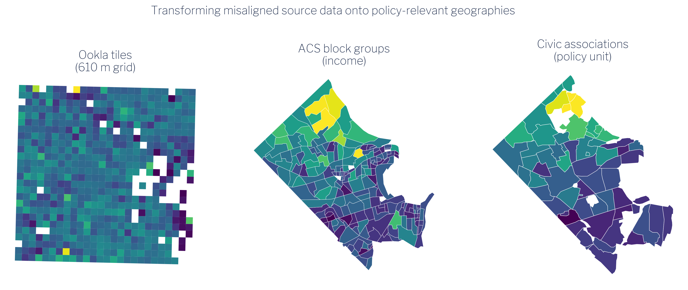

# The Problem of Misaligned Boundaries {#sec-maup}

Every geographic dataset comes packaged in a particular set of spatial units — the shapes that define where each observation applies. Census estimates arrive at the block-group or tract level. Speed-test tiles come in a fixed web-mercator grid. Administrative records attach to parcels, precincts, or service zones. The problem is that the boundaries used to collect and publish one dataset almost never match those used for another, and neither typically matches the policy geography where decisions get made.

## The Modifiable Areal Unit Problem

This mismatch has a formal name in spatial statistics: the **Modifiable Areal Unit Problem**, or MAUP [@ref50]. The MAUP has two related components. The *scale effect* describes how statistical summaries — means, correlations, rates — change when the same underlying data is aggregated to larger or smaller units. The *zonation effect* describes how the same summary statistics change when you redraw boundaries at the same scale but in a different configuration. Neither effect is a modeling error; both are inherent properties of spatially aggregated data.

The practical consequence for local policy work is significant: the relationship you observe between two variables can change substantially depending solely on the geographic units you use to measure it [@ref79]. A correlation between income and broadband access that appears strong at the block-group level may weaken, strengthen, or reverse at the civic-association level — not because the underlying relationship changed, but because the boundary choice changed. Analysts who do not account for this can draw conclusions that are artifacts of the data's packaging rather than reflections of reality.

## Three misaligned geographies

This guide works with three source geographies, none of which aligns with the others.

**Ookla speed-test tiles** are delivered on a zoom-level-16 web-mercator grid. Each tile is approximately 610 meters on a side — a fixed, global grid with no relationship to any political or administrative boundary. Tiles do not respect county lines, block-group edges, or neighborhood borders.

**ACS block groups** are the Census Bureau's smallest standard geography for which the five-year American Community Survey publishes reliable estimates. Block groups within Arlington County range widely in area and population density; their boundaries follow streets, water features, and other physical markers that predate any local policy unit.

**Arlington civic associations** are community-defined neighborhoods that serve as the county's formal channels for resident input and local governance. Their 62 boundaries were drawn through local political and historical processes, not by any statistical agency, and they bear no systematic relationship to the Census hierarchy.

The figure below illustrates the transformation this guide performs: taking source data packaged in two incompatible grids and producing estimates on the policy-relevant civic-association geography.

{#fig-transform width=100%}

As @fig-transform shows, a single civic association may overlap dozens of Ookla tiles and several block groups simultaneously. No one-to-one correspondence exists between any pair of these three geographies. The method described in subsequent chapters — areal-weighted interpolation — handles this overlap systematically by distributing each source observation across target units in proportion to the share of its area that falls within each target unit.

The key assumption underlying this approach is that the quantity of interest is distributed uniformly within each source unit. That assumption is never perfectly true, but it is a principled and auditable starting point — and far preferable to ignoring the boundary problem altogether.
