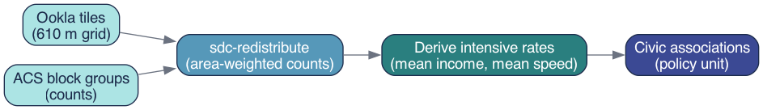

# The Core Method: Areal Interpolation {#sec-method}

The fundamental challenge of local-level data work is geometric: you have numbers attached to one set of polygons and questions about a different set of polygons. Areal interpolation is the family of methods that bridges that gap. The specific technique used throughout this guide — area-weighted redistribution — is the most transparent and widely applicable member of that family [@ref99; @ref135].

## How area-weighted redistribution works

The governing idea is simple: if a source area's polygon overlaps 40% of a target area's polygon, then 40% of that source area's count is assigned to that target area. More precisely, for each pair of source and target polygons that intersect, the method computes the fractional overlap — the ratio of intersection area to source area — and multiplies the source value by that fraction. When a target polygon overlaps multiple source polygons, the contributions from each source are summed to produce the target estimate.

Formally, the weight $w_{ij}$ applied when transferring a value from source polygon $i$ to target polygon $j$ is:

$$w_{ij} = \frac{\text{area}(i \cap j)}{\text{area}(i)}$$

The weights across all target polygons that share area with source polygon $i$ sum to 1.0, so the total value in the source layer is conserved. This is the key constraint that distinguishes redistribution from other forms of spatial estimation: values are allocated, not created.

The method rests on one explicit assumption: the variable of interest is distributed uniformly within each source polygon. Population is not perfectly uniform within a Census block group, and download speed is not perfectly uniform across a 610-meter Ookla tile. But the assumption is transparent, auditable, and consistent — and it systematically outperforms simply ignoring the boundary problem altogether [@ref139].

## Extensive vs. intensive measures {#sec-extensive-intensive}

This is the most important concept in the entire chapter. Understanding it determines whether your redistributed estimates are correct or subtly wrong.

Geographic measures divide into two fundamentally different types based on how they relate to the size of the area they describe.

**Extensive measures** (also called additive or count-like measures) *scale with area*. If you split a block group in two, each half has roughly half the total households, roughly half the aggregate income, roughly half the test count. Extensive measures can be legitimately redistributed using area weights because the splitting and summing is arithmetically valid. Examples: total households, aggregate household income, total speed-test count.

**Intensive measures** (also called rate-like or derived measures) *do not scale with area*. Mean income is the same whether you measure it for the whole block group or for a one-block sliver of it. If you split a block group and assign each half 40% of its mean income, you have made a category error — you are treating a rate as if it were a count. Examples: mean income, mean download speed, population density, any ratio.

The practical rule is therefore:

> **Redistribute counts. Derive rates afterward.**

To produce a valid mean income for a civic association, you redistribute *aggregate income* (extensive) and *household count* (extensive) separately to each civic association, then divide: $\text{mean income} = \text{agg. income} \div \text{households}$. You never redistribute mean income directly.

The same logic applies to a statistic that analysts sometimes want but cannot obtain this way: **the median**. Median household income is fundamentally a positional statistic — it describes the midpoint of a distribution — and it has no additive decomposition. There is no arithmetic operation on two partial medians that recovers the median of their union. If you areally redistribute a median, the result is numerically meaningless. This guide uses aggregate income precisely because medians cannot be handled this way.

Getting this distinction wrong is the single most common error in areal interpolation. It produces estimates that look plausible but are quietly incorrect — typically biased toward area-weighted means of the *rate* rather than the *population-weighted* mean that the underlying counts would produce. In areas with uneven population density (as Arlington has — denser urban corridors alongside lower-density suburban neighborhoods), this error can be substantial.

@fig-dataflow summarizes the full redistribution workflow: extensive counts enter the redistribution, area weights are applied, and intensive rates are computed only at the end from the redistributed count totals.

{#fig-dataflow width=100%}

## The `sdc-redistribute` implementation

In practice, the redistribution is performed by the `sdc_redistribute` Python package, which handles the geometric intersection, weight calculation, and column-wise multiplication in a single call. The source geometry and one or more target geometries are supplied as GeoJSON or GeoDataFrame objects; the caller specifies which columns are extensive counts. The function returns a target-geometry GeoDataFrame with redistributed count columns that can be combined or divided to produce any desired derived measure.

::: {.callout-note collapse="true" title="Python: the redistribution call"}
```python
from sdc_redistribute import redistribute_direct

result = redistribute_direct(
    source_df=counts_long,            # geoid, year, measure, value
    source_geo="block_groups.geojson",
    target_geos={"civic_association": "civic_assoc.geojson"},
    count_cols=["agg_income", "households"],   # EXTENSIVE counts
    source_id="geoid",
)
# mean income (INTENSIVE) is derived afterwards:
#   mean_income = agg_income / households
```
:::

The collapsible snippet above shows the essential pattern: only extensive counts are passed to `count_cols`. The intensive quantity — mean income — is not a parameter to the function; it is computed by the analyst on the output. This design makes the extensive-vs-intensive distinction architecturally explicit: the function cannot produce a rate; it can only redistribute counts.

The worked example in @sec-example applies this pattern twice in sequence, once for income and once for broadband speed, and then validates that the redistributed totals are internally consistent before proceeding to analysis.
